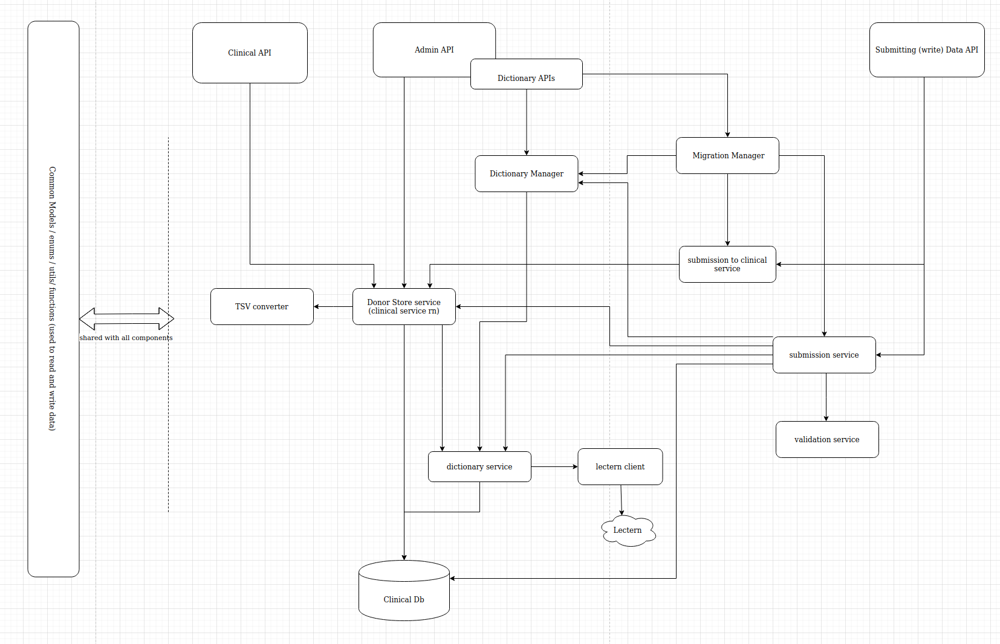

# Argo clinical

## Requirements:

- node 12+
- Mongo 4.0

## Design

## How to:

Make scripts are provided to run this application and the required MongoDB using docker. In order for these scripts to start the dev server, you must have a debugger application waiting to attach on port `9229`. This is easily accomplished by running these commands in the VSCode terminal, and updating the `Debugger Auto Attach` setting in VSCode settings to `yes`.

- run: `make` this will bootstrap everything, docker compose, and the service
- `make debug` will only restart the clinical service, without docker compose
- tests: `make verify`

To run local without engaging the debugger, run `npm run local`. Since this will not run the docker-compose setup, this requires MongoDB to be running locally (connections configured in the .env file)
See `Makefile` for more details and options.

## Debugging Notes:

If file upload fails with the error `TypeError: Cannot read property 'readFile' of undefined`, make sure you are running Node 12+

## DB migration

We use a tool called migrate-mongo: https://www.npmjs.com/package/migrate-mongo

- create script: `npx migrate-mongo create <issue #>-<my-script-name>`
- run migration: `npx migrate-mongo up`
- rollback: `npx migrate-mongo down`
  - With this command, migrate-mongo will revert (only) the last applied migration
- status: `npx migrate-mongo status`

Notes:

- make scripts idempotent in case they fail in the middle
- if a script fails it will stay in pending state
- you can't change the the contents after the script ran, it wont run again automatically
  - if you need to change the script you have to write another script that does what you want
- the scripts are sorted by date & time
- a collection in db called changelog will keep track of executed scripts.
- the docker image will excute the scripts automatically before starting the server and if fails it runs rollback script and exits

## Extending stub-schema for running DB migration Tests

- extend upon the [schema builder](/test/integration/submission/migration_utils/schema_builder.ts) with the new schema
- run the script using `argo-clinical/test/integration/submission$ npx ts-node ./migration_utils/schema_builder.ts` to generate the [migration-stub-schema.json](/test/integration/submission/migration-stub-schema.json)
- grab the newer schema with the one you want to compare with (usually v1.0) and run it through [lectern's diff calculator](https://github.com/overture-stack/lectern/blob/master/src/diff/DictionaryDiff.ts)
- paste the diff as a new entry into [stub-diffs.ts](test/integration/submission/migration_utils/stub-diffs.ts)
-  note: this process could eventually be improved by running lectern in a container so it can automatically serve the schema and compute the diffs 

## importing rxnorm

you can see the compose directory for the simplified process
it's recommended to use mysql 5.7, 5.6. or 5.5 mysql 8 has issues, but works nonetheless.

- download the full zip file
- mount it in the mysql container
- move all mysql scripts from scripts folder to rrf folder.

the job to import this: https://jenkins.qa.cancercollaboratory.org/job/ARGO/job/devops/job/rxnorm-import/

# Lectern client

## work live with overture client without publishing new versions

in clinical package json:
1- "@overturebio-stack/lectern-client": "file:/home/ballabadi/dev/repos/overture/js-lectern-client",
2- go to lectern client, update code and `npm run build`
3- install the updated version `npm i`

## how to debug schema client :

1- put debug point here: manager.ts function
2- when break point hits, step into lectern client func
3- place break point in lectern client file
